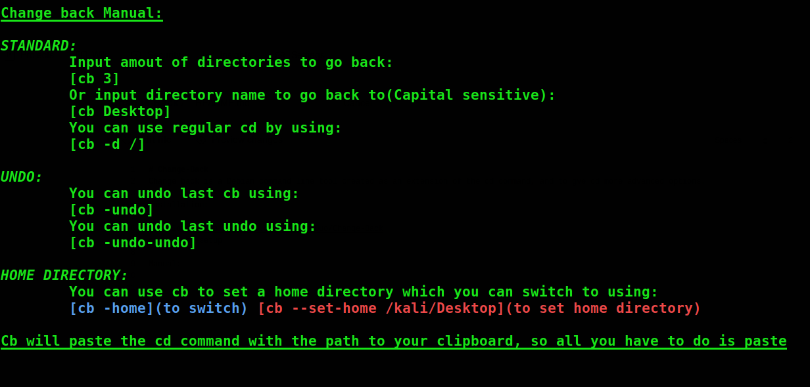

# Change-Back
Change back is a Debian command line tool created as an extension of the cd command, and to gve cd more advanced options.

##### *Installation:*
```
git clone https://github.com/StateraDuo/Change-Back
cd Change-Back
sudo ./cb -setup
```
##### *Manual:*


To access manual use:
```
cb --help
```
